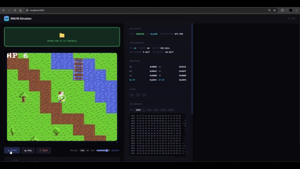
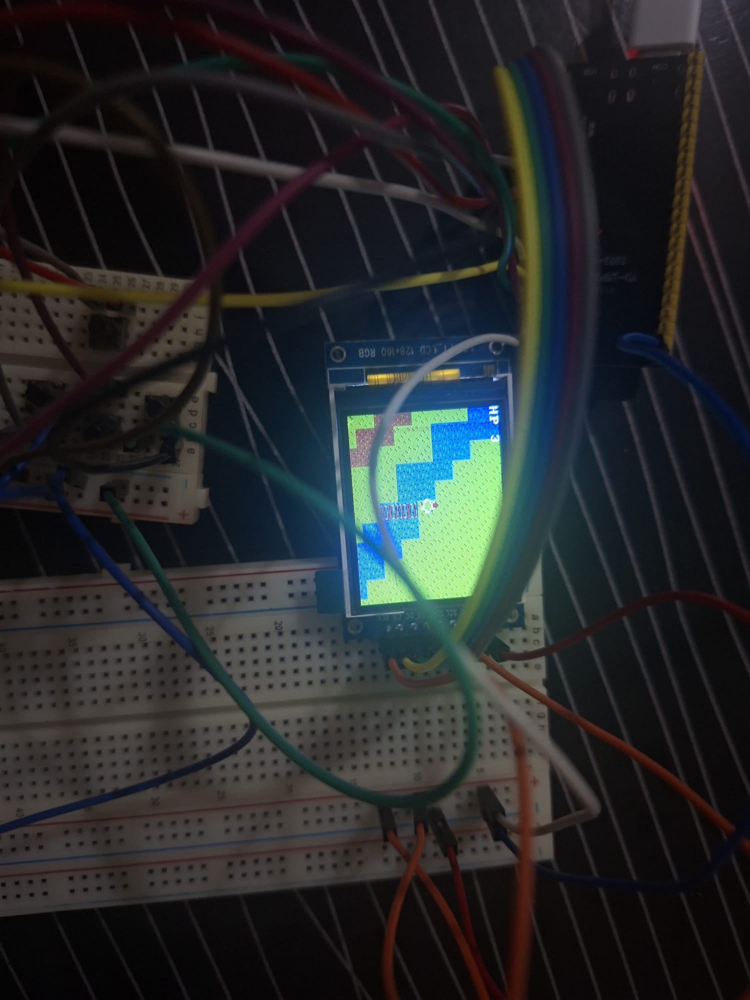
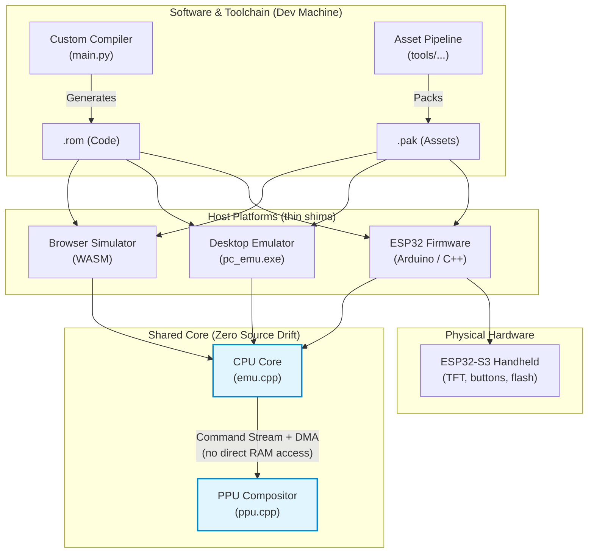

# EMU16

A homebrew game platform built from scratch: a custom 16-bit CPU, a C-like compiler that targets it,
a NES-style tile/sprite PPU, an ESP32-S3 handheld, and a browser simulator — all in one repo, all
running the same core. Write a game once; run it on real hardware, in a terminal, or in a browser tab.

<p align="center">
  
  
</p>
<p align="center"><sub>Same <code>arena.rom</code>, unmodified — the simulator (left) and the real ESP32-S3 handheld (right).</sub></p>

| | |
|---|---|
| **Language** | C-like: types, structs, classes, arrays, pointers, strings, bitwise/shift, `if`/`else`, `while`/`for`, `switch` (O(1) jump table), `const`, inline asm |
| **Compiler** | Hand-written: regex-NFA lexer → recursive-descent parser → TAC IR → linear-scan allocator → `.rom` |
| **CPU** | Custom 16-bit, 8 registers, 64 KB little-endian address space |
| **PPU** | Separate NES-2C02-style tile + sprite + text unit with its own graphics RAM |
| **Targets** | ESP32-S3 handheld · desktop emulator (`pc_emu`) · browser WebAssembly sim |
| **Assets** | Draw in [LibreSprite](https://libresprite.github.io/), paint tilemaps as PNGs, stream everything from a `.pak` |

## Quick start

```bash
make pc_emu wasm                                       # build the desktop emulator + WASM sim
python main.py examples/arena.txt --save-rom arena      # compile -> build/roms/arena.rom
pc_emu.exe --rom build/roms/arena.rom --frames 60       # run headless -> build/pc_emulator/frame.ppm
cd simulator && python -m http.server                   # or: play it in a browser tab
```

```bash
make test      # compile + run the full regression suite
make verify    # headless WASM cross-check -- proves the browser core matches pc_emu bit-for-bit
make flash && make uploadfs   # build + flash the real handheld (needs PlatformIO)
```

Requirements: Python 3.7+ · GCC/MinGW (`pc_emu`) · Emscripten (WASM) · Node (WASM verify) ·
PlatformIO (firmware). Full command reference per target:
[docs/pc-emulator.md](docs/pc-emulator.md) · [docs/simulator.md](docs/simulator.md) ·
[docs/firmware.md](docs/firmware.md).

## Architecture

Only one thing here is physical — everything else is the same emulator core wearing a different
host shim:



- **Hardware** — an ESP32-S3 handheld: TFT display, 8 buttons, an SD reader wired for later. Pins:
  [`firmware/src/hw_pins.h`](firmware/src/hw_pins.h).
- **Firmware** — a PlatformIO/Arduino project (`firmware/`) that boots the shared core on the ESP32.
  It doesn't contain a second emulator: `emu_shim.cpp`/`ppu_shim.cpp` `#include` the real
  `emulator/emu.cpp`/`ppu.cpp` directly.
- **The shared core** (`emulator/emu.cpp` + `ppu.cpp`) — the actual CPU + PPU emulation, compiled
  three ways (native for `pc_emu`, Arduino for firmware, Emscripten for the browser) with zero source
  drift. This is *why* one `.rom` runs identically everywhere.
- **Software** — the compiler (`src/`), the libraries (`lib/`), and the asset pipeline (`tools/`) that
  run on your dev machine and produce a `game.rom` + `game.pak`.

Full depth — the CPU ISA and instruction encoding, the PPU's command-stream protocol and the
"never touches CPU memory" invariant, the compiler's pipeline stage by stage — is in
**[docs/architecture.md](docs/architecture.md)**.

## Making a game

One example covers most of the language:

```c
include "lib/io.lib";
{
    var byte pal[3] = {1, 2, 4};            // arrays; initializer list is baked into the ROM
    int add(int a, int b) { return a + b; }

    int main() {
        var int x = 0;
        while x < SCREEN_WIDTH {             // parens around conditions are optional
            if (x & 1) == 0 {               // & | ^ bind looser than == (unlike C)
                x = x + 1;
            }
            x = x + 1;
        }
        var int p = &x;                     // pointers: & address-of, * dereference
        return *p;
    }
}
```

Types: `int` (16-bit), `byte`, `bool`, `void`, `struct` (data-only, byte-packed), and compile-time
`class` (monomorphized into plain globals + functions — composition, `self.field`, no inheritance).
`const NAME = <expr>;` folds to a literal at compile time. `include "path";` splices a file's source
in — there's no separate linker, so two included files defining the same name is a compile error, not
a silent clash. Full language reference (grammar, operator precedence, every quirk):
**[docs/language.md](docs/language.md)**; real programs: `examples/`.

**Draw nothing yourself — the PPU does.** Each frame you build a small command buffer
(`lib/ppu.lib`: scroll, sprites, text) and hand it to the PPU with `ppu_present()`; bulk art streams
straight from the `.pak` into PPU RAM. `lib/scene.lib` reflects the resident world onto the screen —
a follow camera, tilemap streaming for worlds bigger than one screen, Y-sorted sprites — while
`lib/map.lib` owns the world itself: `map_load(pak_id)` swaps the whole resident world (with its own
tileset/spawns/warps/entry points) at runtime, plus tile-collision queries (`map_solid_at`). The
other libraries: `io.lib` (input + peek/poke), `sys.lib` (every host syscall), `game.lib` (PRNG +
AABB collision), `event.lib` (256 save-backed flags — the spine for one-time triggers and branching
dialog). Each library has exactly one job; full per-function reference:
**[docs/libraries.md](docs/libraries.md)**.

**Assets:** draw in LibreSprite (indexed mode), export PNG+JSON, list them in a `sprites.list`, run
`tools/image_import.py` then `tools/pack_assets.py` to get a `.pak`. Paint tilemaps as an indexed PNG
(1 pixel = 1 tile) with `tools/pixel_map.py` (one map baked into the ROM) or `tools/map_set.py`
(a whole folder of maps, pak-loaded at runtime, linked by warps). Full tool usage, flags, and file
formats: **[docs/tools.md](docs/tools.md)** and **[docs/file-formats.md](docs/file-formats.md)**.

**Talking to the host:** a ROM asks the host to list ROMs, save/load, stream an asset, or drive the
PPU via a *syscall* — write a number to `SYSCALL_PORT`, get a result in `R0`. Full table:
**[docs/syscalls.md](docs/syscalls.md)**.

## Documentation

| Doc | Covers |
|---|---|
| [docs/architecture.md](docs/architecture.md) | The four layers in depth: hardware, firmware, the shared CPU+PPU core, the compiler pipeline. CPU ISA & instruction encoding, PPU command protocol. |
| [docs/language.md](docs/language.md) | The full language reference: grammar, types, operator precedence (with a verified C-difference gotcha), control flow, structs/classes, inline asm — the authoritative source, not source-code comments. |
| [docs/compiler.md](docs/compiler.md) | Compiler internals: the TAC IR and `Var` identity rules, semantic analysis, class monomorphization, the optimizer's passes, the register allocator, and the backend's operand-aware code emission (byte/word quirks, ISA constraints, known limitations). |
| [docs/memory-map.md](docs/memory-map.md) | The full CPU address space (down to what's actually inside DATA and why) and the PPU's separate graphics RAM, region by region. Calling convention. |
| [docs/syscalls.md](docs/syscalls.md) | Every syscall: args, result, per-host differences. |
| [docs/file-formats.md](docs/file-formats.md) | `.rom`, `.pak` (EPAK), map blobs, save files — byte layouts and the build→deploy→runtime lifecycle. |
| [docs/libraries.md](docs/libraries.md) | Every function in `lib/*.lib`, library by library. |
| [docs/tools.md](docs/tools.md) | Every script in `tools/`: CLI usage, flags, what each one emits. |
| [docs/simulator.md](docs/simulator.md) | The browser sim's internals: build, JS architecture, debug/memory-viewer features. |
| [docs/pc-emulator.md](docs/pc-emulator.md) | `pc_emu.exe`'s CLI flags, output format, and how the regression suite uses it. |
| [docs/firmware.md](docs/firmware.md) | The ESP32-S3 firmware: boot flow, main loop, storage seam, syscall handler, toggles. |

## Directory layout

```
src/         compiler: lexer · parser · analyzer · codegen · optimization · backend
emulator/    emu.cpp (CPU core) + ppu.cpp (PPU) + definitions.h, the PC harness, the WASM bridge
firmware/    ESP32-S3 PlatformIO project (main.cpp, hw_pins.h, data/ ROMs)
simulator/   browser sim -- HTML/JS over the WASM core (display + CPU/PPU debug panels)
lib/         io.lib (I/O) · sys.lib (syscalls) · ppu.lib (PPU commands + font) · map.lib (pak-loaded
             maps + collision) · scene.lib (camera + sprite cast) · game.lib · event.lib
tools/       sprite.py (ASCII->array, legacy) · png.py + image_import.py (LibreSprite->assets) ·
             pack_assets.py (.pak) · pixel_map.py + map_set.py (tilemaps, single map / multi-map set)
examples/    arena.txt (PPU scene reference: multi-map world + collision + combat + a talking NPC),
             menu.txt (home screen), block_blast.txt (brick-breaker: baked tile/sprite art, no .pak
             needed); generated/ holds arena's compiled asset-id includes (NOT source -- regenerated
             by the build recipe in its own header comment)
assets/      hand-authored source art: sprites/ (LibreSprite PNG+JSON + sprites.list + master
             palette) and maps/ (tools/pixel_map.py / map_set.py PNG + legend + .map.txt descriptors)
docs/        deep technical reference -- see the table above; media/ holds README screenshots/gifs
             (NOT build input -- see assets/ for that)
tests/       regression sources      main.py · run_tests.py · Makefile
```
