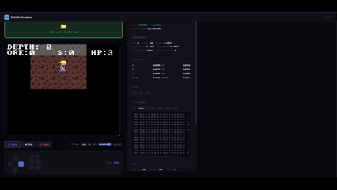
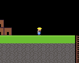
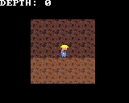
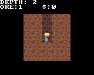
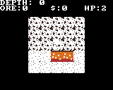
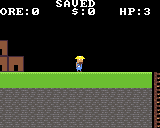

# Making a Game: _Deeper_

_Build a complete side-view mining game for EMU16 from an empty screen to a torch-lit, ore-hunting,
save-your-progress little world. No prior EMU16 experience needed; each chapter ends with something you
can run._



## What you'll build

A digger who walks, jumps, and tunnels through a destructible mine, with a follow-camera descent into
torch-lit darkness, ore to collect, a surface shop, hazards, sound, and saved progress. We add one
system at a time you always have a working game.

## How to read this

Every chapter ends with a **▶ Run it** box: a command and exactly what you should see. Code is shown as
**additions** to the file you're building. If something breaks, each checkpoint links to its **complete
source** under [`examples/tutorial/`](../examples/tutorial) diff your file against it to spot what's
missing.

You'll want the repo built (`pc_emu` for quick checks, or the browser sim / hardware to actually play).
Compile a chapter with `python main.py <your-file>.txt --save-rom deeper`.

## Contents

1. [A world on screen](#chapter-1-a-world-on-screen)
2. [The digger appears](#chapter-2-the-digger-appears)
3. [Gravity, walk & jump](#chapter-3-gravity-walk--jump)
4. [Dig!](#chapter-4-dig)
5. [Down the mine](#chapter-5-down-the-mine)
6. [The surface & the descent](#chapter-6-the-surface--the-descent)
7. [Torchlight](#chapter-7-torchlight)
8. [Ore & the shop](#chapter-8-ore--the-shop)
9. [Hazards & health](#chapter-9-hazards--health)
10. [Sound & music](#chapter-10-sound--music)
11. [Save & load](#chapter-11-save--load)
12. [Make it your own](#chapter-12-make-it-your-own)

---

## Chapter 1 A world on screen

Before anything digs, there has to be something to dig through. In this chapter we put a mine on the
screen: a wall of dirt, a stone border, and a little pocket of open air at the top.

The key idea the one everything else in this game leans on is that **the world is just a grid of
bytes**. One byte per 16×16 tile, and that byte is the tile's pattern slot (which art to draw). Later
that exact same grid becomes the collision map and the thing you dig into. One array, many readers.

### 1.1 The skeleton and the frame loop

Start a file (call it `deeper.txt`). Pull in the libraries we need, the generated asset ids (the next
step explains those), and set up the shape every EMU16 game has a loop that builds a frame and
presents it:

```c
include "../../lib/io.lib";      // input (used from Chapter 3)
include "../../lib/ppu.lib";     // the PPU command builder + the frame shape
include "../../lib/scene.lib";   // scene_stream: draw the visible window of the world
include "deeper_assets.gen.txt"; // PAL_MASTER / ANIM_*_ID -- generated by image_import (next step)
{
    int main() {
        while (true) {
            cmd_reset();            // start a fresh frame's command list
            ppu_backdrop(0x0000);   // clear to black
            // ... build the frame here ...
            ppu_present();          // hand the frame to the PPU: compose, display, pace
        }
        return 0;
    }
}
```

The CPU never draws pixels itself. Each frame it _builds a little command list_ (`cmd_reset` …
`ppu_present`) and the PPU composites tiles and sprites from it. That's the whole rhythm of the game.

### 1.2 Draw the art, import it with the tools

A tile and later a sprite is a 16×16 image of palette indices. You could type those bytes by
hand, but EMU16 has a real asset pipeline: draw in **LibreSprite** in indexed mode, import with `image_import.py`, pack
into a `.pak` the game loads. We use it from the start.

Draw your **dirt** and **stone** tiles (16×16 each) in LibreSprite over a shared palette, and export each
as an indexed PNG + its JSON, plus the palette as a `.gpl`. (The finished art for _Deeper_ is in
[`assets/sprites/tutorial/`](../assets/sprites/tutorial) the two tiles and the miner sheets all
sharing `assets/palettes/deeper_palette.gpl`.) List them for the importer in a small `tutorial.list`:

```
master  ../../palettes/deeper_palette.gpl  -  -
dirt    dirt.png       dirt.json    10
stone   stone.png      stone.json   10
# (the miner sheets join this list in Chapter 2)
```

Then build the pak two commands:

```
python tools/image_import.py assets/sprites/tutorial/tutorial.list build/tutorial_assets
python tools/pack_assets.py  build/tutorial_assets/assets.manifest  build/roms/deeper
```

`image_import` writes **`deeper_assets.gen.txt`** the `const` ids your game includes (`PAL_MASTER`,
`ANIM_DIRT_ID`, `ANIM_STONE_ID`, …) plus one `.bin` per asset; `pack_assets` bundles those into
**`build/roms/deeper.pak`**. Copy `deeper_assets.gen.txt` next to your `deeper.txt` so the `include`
above finds it.

> **Slot 0 is free.** Pattern slot 0 is never written, so it stays all-zero (every pixel palette index 0).
> It's the tile you get for "nothing" you'll see it as the black **sky** on the surface. Underground,
> though, empty space is _not_ black: a dug tunnel becomes the visible **dirt-background** tile (Chapter 5)
> non-solid, but clearly carved dirt rather than a hole into the void. (In a _sprite_, that same all-zero
> byte is transparent, which is what gives the miner a shape instead of a square.)

### 1.3 The world grid (and a look ahead)

Here's the star of the show the byte grid, plus the property table it will pair with later:

```c
    const MAP_W = 24;  const MAP_H = 40;                 // 24 wide, 40 deep
    const T_AIR = 0;   const T_DIRT = 1;   const T_STONE = 2;

    var byte world[960];                                  // MAP_W * MAP_H, one tile id per cell

    // Read from Chapter 3 on: bit 0 = solid, bit 2 = diggable. Here just so you can see the plan:
    // the SAME id that picks the art also indexes this table to get the tile's behaviour.
    var byte tile_flags[8] = { 0, 5, 1, 0, 0, 0, 0, 0 };  // air=0  dirt=solid+dig  stone=solid
```

We fill the grid in code: a stone border so nothing can escape, dirt inside, and a carved pocket at the
top so there's some open air to see:

```c
    void build_world() {
        var int x; var int y; var int idx;
        y = 0;
        while y < MAP_H {
            x = 0;
            while x < MAP_W {
                idx = y * MAP_W + x;
                if x == 0 { world[idx] = T_STONE; }
                else if x == MAP_W - 1 { world[idx] = T_STONE; }
                else if y == 0 { world[idx] = T_STONE; }
                else if y == MAP_H - 1 { world[idx] = T_STONE; }
                else { world[idx] = T_DIRT; }
                x = x + 1;
            }
            y = y + 1;
        }
        y = 1;
        while y <= 3 { x = 1; while x < MAP_W - 1 { world[y * MAP_W + x] = T_AIR; x = x + 1; } y = y + 1; }
    }
```

### 1.4 Load the art, draw the world

Load the palette and tiles from the pak into PPU memory once, at the top of `main` `sys_ppu_dma`
copies a pak asset straight into PPU RAM then call `build_world`:

```c
        sys_ppu_dma(PAL_MASTER, PPU_PAL);                     // the palette
        ppu_upload_font(&font8x8);
        sys_ppu_dma(ANIM_DIRT_ID,  PPU_PAT + T_DIRT * 256);   // dirt art  -> slot 1
        sys_ppu_dma(ANIM_STONE_ID, PPU_PAT + T_STONE * 256);  // stone art -> slot 2

        build_world();
```

Then one line inside the loop turns the grid into pixels:

```c
            scene_stream(&world, MAP_W, MAP_H);   // between ppu_backdrop and ppu_present
```

`scene_stream` reads the world array and pushes the on-screen window of tiles to the PPU, drawing each
cell with the art at its slot. With no camera set yet, it shows the top-left corner.

> **▶ Run it**
>
> ```
> python main.py deeper.txt --save-rom deeper     # (deeper.pak was built in step 1.2)
> ```
>
> Run `deeper.rom` with `deeper.pak` beside it, in the browser sim or `pc_emu`. You should see the top
> of the mine: a **stone border**, a **black pocket** of air, and a wall of **textured dirt** below.
>
> 
>
> 📄 Full source: [`examples/tutorial/ch01.txt`](../examples/tutorial/ch01.txt)

That's a world. It doesn't do anything yet but it's a real, addressable grid, and in the next chapter
we drop a digger onto it.

---

## Chapter 2 The digger appears

Time to meet our miner. Unlike the world, the player isn't a background tile it's a **sprite**: a small
image the PPU draws _on top_ of the tiles, at any pixel position. His art is already in our pipeline; we
load it and let `anim.lib` cycle the frames. He doesn't move yet he just stands there.

### 2.1 Add the miner to the pak

The miner sheets are already drawn in [`assets/sprites/tutorial/`](../assets/sprites/tutorial), sharing
the same palette (no new colours to declare that's the point of one shared `.gpl`). Add them to
`tutorial.list` and rebuild the pak with the two commands from Chapter 1:

```
miner       miner.png           miner.json            5
miner_walk  miner_walking.png   miner_walking.json    5
miner_jump  miner_jumping.png   miner_jumping.json    5
miner_mine  miner_mining.png    miner_mining.json     5
```

Now `deeper_assets.gen.txt` also defines `ANIM_MINER_ID` (idle, 2 frames), `ANIM_MINER_WALK_ID` (3),
`ANIM_MINER_JUMP_ID` (2), and `ANIM_MINER_MINE_ID` (5). We use the idle here; walk/jump/mine come later.

### 2.2 Load the idle clip

A **clip** in `anim.lib` is a run of consecutive pattern slots one per frame. DMA the miner's 2-frame
idle to slots 8–9, clear of the tile slots (1, 2):

```c
    const PAT_IDLE = 8;                        // the idle clip's first slot
```

```c
        sys_ppu_dma(ANIM_MINER_ID, PPU_PAT + PAT_IDLE * 256);   // 2 frames -> slots 8, 9
```

> **Index 0 is transparent in a sprite** every `0` in the miner's art lets the background show through,
> which is what gives him a _shape_ instead of a square. (Same all-zero byte that leaves slot 0 the black sky.)

### 2.3 Let anim.lib run it

The player lives in **world pixel** coordinates (not screen `scene_draw` converts that for us):

```c
    var int player_x = 0;   var int player_y = 0;
```

At boot, after `build_world()`, place him and start the clip:

```c
        player_x = 5 * 16;   player_y = 48;         // stand in the pocket, on top of the dirt
        anim_play(0, PAT_IDLE, 2, clip_period[ANIM_MINER_ID]);   // 2 frames, at the miner's own speed
```

`anim_play(entity, base, count, period)` starts a clip; from there `anim.lib` tracks time itself. Each
frame we ask `anim_pat(0)` which slot to draw _now_ it returns 8 or 9 by elapsed time, so the animation
runs at the same speed no matter the frame rate.

> **The `period` is your LibreSprite frame duration.** `image_import` read the duration you set per frame
> and wrote it into `clip_period[]` (in `deeper_assets.gen.txt`), indexed by asset id. Passing
> `clip_period[ANIM_MINER_ID]` means the speed you drew in LibreSprite is the speed it plays set it in
> the editor, not in code.

### 2.4 Draw the miner

Sprites go through a tiny cast each frame clear it, add the player at his world position, draw. Put
these three lines between `scene_stream(...)` and `ppu_present()`:

```c
            scene_clear();                                  // begin this frame's sprite cast
            scene_obj(anim_pat(0), player_x, player_y, 0);  // add the miner (world coords)
            scene_draw();                                   // world -> screen -> OAM
```

`scene_draw` turns his world position into a screen position (via the camera, still parked at the
top-left) and hands it to the PPU as a sprite.

> **▶ Run it**
>
> ```
> python main.py deeper.txt --save-rom deeper
> ```
>
> The miner should be standing on the dirt in the pocket, his idle animation cycling as `anim.lib`
> steps through the clip.
>
> 
>
> 📄 Full source: [`examples/tutorial/ch02.txt`](../examples/tutorial/ch02.txt)

He's just standing there but he's a real sprite at a real world position, animating on his own clock.
In Chapter 3 we give him weight: gravity, walking, and a jump.

---

## Chapter 3 Gravity, walk & jump

This is the chapter that turns a picture into a game. `lib/platform.lib` gives the miner velocity and
gravity, and slides him along solid tiles colliding against the **same grid we drew**. A tile is solid
purely because of its `tile_flags` entry, so the world you painted _is_ the level geometry. The physics
is all code; the only new art is the walk and jump clips already in your pak.

### 3.1 Hand the world to the physics

`platform.lib` needs three things: the grid, its dimensions, and the flags table. Bind them once, drop
the miner into the pocket, and pin the frame rate (the physics steps per frame, so a steady rate keeps a
steady feel):

```c
        plat_bind(&world, MAP_W, MAP_H, &tile_flags);   // collide against this exact grid
        plat_spawn(5 * 16, 32);                          // drop him into the air pocket
        sys_set_fps(60);
```

This is the payoff of Chapter 1's "one grid, two readers." The renderer reads `world` to draw tiles; the
physics reads the _same_ `world` (through `tile_flags`, testing bit 0 for solid) to decide what to stand
on. Dirt and rock are solid, air isn't and that falls out of the table, not special-case code.

### 3.2 Turn input into one physics step

Each frame, read the d-pad into a direction and a jump, then take one step:

```c
    // (declare `var int ix; var int jmp; var int pattr;` at the top of main)
            ix = 0;
            if button(BTN_LEFT)  { ix = 0 - 1; }
            if button(BTN_RIGHT) { ix = 1; }
            jmp = 0;
            if button_pressed(BTN_A) { jmp = 1; }
            plat_update(ix, jmp);
```

`plat_update(input_x, jump_pressed)` takes `input_x` as −1/0/+1 (walk) and a jump _only on the frame A is
freshly pressed_ that's what `button_pressed` gives you (an edge, not a hold), so tapping jumps once.
For edges to work, call `buttons_update()` once per frame (we put it just before `ppu_present`).

### 3.3 Draw him where the physics put him

Swap Chapter 2's fixed position for the live one, and flip the sprite to face his heading:

```c
            pattr = 0;
            if plat_facing == (0 - 1) { pattr = 1; }        // attr bit 0 = flip horizontally
            scene_obj(anim_pat(0), plat_x, plat_y, pattr);
```

`platform.lib` tracks `plat_x` / `plat_y` (his position) and `plat_facing` (−1 left, +1 right) for you.

### 3.4 Animate his state

The pak has walk and jump sheets too DMA them to their slots (alongside the idle DMA from Chapter 2):

```c
    const PAT_WALK = 10;   // 3 frames -> slots 10,11,12
    const PAT_JUMP = 13;   // 2 frames -> slots 13,14
```

```c
        sys_ppu_dma(ANIM_MINER_WALK_ID, PPU_PAT + PAT_WALK * 256);
        sys_ppu_dma(ANIM_MINER_JUMP_ID, PPU_PAT + PAT_JUMP * 256);
```

Then each frame, pick the clip that matches his state. `anim_play` only restarts a clip when it
_changes_, so calling it every frame is fine hold a walk and it keeps its phase:

```c
            if plat_grounded == 0 { anim_play(0, PAT_JUMP, 2, clip_period[ANIM_MINER_JUMP_ID]); }
            else { if ix == 0 { anim_play(0, PAT_IDLE, 2, clip_period[ANIM_MINER_ID]); }
                   else { anim_play(0, PAT_WALK, 3, clip_period[ANIM_MINER_WALK_ID]); } }
```

Airborne → jump clip; on the ground and moving → walk; standing still → idle each at the frame speed you
set for it in LibreSprite (`clip_period[...]`). This replaces the single boot-time `anim_play` we started
with.

> **▶ Run it**
>
> ```
> python main.py deeper.txt --save-rom deeper
> ```
>
> **←/→** to walk, **A** to jump. He falls out of the air, lands on the dirt, and runs along it
> playing his walk cycle as he moves and his jump pose in the air. The camera doesn't follow yet (that's
> Chapter 5), so stay on-screen for now.
>
> 
>
> 📄 Full source: [`examples/tutorial/ch03.txt`](../examples/tutorial/ch03.txt)

That's a platformer. He can move, but he can't yet do the one thing this game is about **dig**. That's
next, and it's where the "one grid" idea really pays off.

---

## Chapter 4 Dig!

Here's the whole reason we built the world as a grid. To dig, we change one byte `world[idx] = AIR`
and _two_ things happen at once: the tile vanishes from the screen (the renderer reads `world`) and it
stops being solid (the physics reads `world`). No "update the collision map" step, no re-render request.
One write, both payoffs.

### 4.1 Aim at a tile

Each frame, work out which tile the miner points at the one just past his body in the way he's facing,
or the tile under his feet (**Down**) / above his head (**Up**):

```c
            if button(BTN_DOWN) {
                tx = (plat_x + 8) >> 4;   ty = ((plat_y + 15) >> 4) + 1;   // under the feet
            } else { if button(BTN_UP) {
                tx = (plat_x + 8) >> 4;   ty = ((plat_y + 1) >> 4) - 1;     // above the head
            } else {
                if plat_facing == 1 { tx = (plat_x + 12) >> 4; } else { tx = (plat_x + 3) >> 4; }
                ty = (plat_y + 8) >> 4;                                     // in front, mid-body
            } }
```

Then check it's in bounds and _diggable_ bit 2 of its `tile_flags` (dirt has it, stone doesn't):

```c
            dig_now = 0;
            if tx >= 0 { if tx < MAP_W { if ty >= 0 { if ty < MAP_H {
                t = world[ty * MAP_W + tx];
                if (tile_flags[t] & F_DIG) != 0 { if button(BTN_B) { dig_now = 1; } }
            } } } }
```

### 4.2 Swing, then break

Digging isn't instant hold **B** and the miner works the tile for `DIG_TIME` frames, then it breaks. A
little state tracks which tile he's on (aim elsewhere and the timer restarts):

```c
    const F_DIG    = 4;    // tile_flags bit 2 = diggable
    const DIG_TIME = 30;   // ~0.5s at 60fps
    var int digging = 0;   var int dig_tx = 0;   var int dig_ty = 0;   var int dig_timer = 0;
```

```c
            if dig_now == 1 {
                if dig_tx != tx { digging = 0; }
                if dig_ty != ty { digging = 0; }
                if digging == 0 { digging = 1; dig_tx = tx; dig_ty = ty; dig_timer = DIG_TIME; }
                dig_timer = dig_timer - 1;
                if dig_timer <= 0 { world[dig_ty * MAP_W + dig_tx] = T_AIR; digging = 0; }
            } else { digging = 0; }
```

That one line `world[...] = T_AIR` is the payoff. Next frame the renderer draws air there, and the
physics lets him walk (or fall) into it: dig down and gravity drops him into the shaft; dig sideways and
he steps through.

### 4.3 The swing animation

While digging, play the 5-frame mining clip it takes priority over walk/idle/jump:

```c
            if digging == 1 { anim_play(0, PAT_MINE, 5, clip_period[ANIM_MINER_MINE_ID]); }
            else { /* the jump / walk / idle logic from Chapter 3 */ }
```

> **▶ Run it**
>
> ```
> python main.py deeper.txt --save-rom deeper
> ```
>
> Stand on the dirt and hold **B** he swings his pick and a tile breaks. **Down + B** mines straight
> down and drops him into the shaft; **Up + B** breaks the block above his head. Stone (the border) won't
> budge it isn't diggable.
>
> 
>
> 📄 Full source: [`examples/tutorial/ch04.txt`](../examples/tutorial/ch04.txt)

You now have the entire core loop: a digger tunnelling through a destructible world. Everything from here
adds richness but _this is the game_. Next, we let the camera follow him down into the deep.

---

## Chapter 5 Down the mine

The mine is meant to be _deep_ far taller than the screen. Two things change: the world becomes a real,
big, hand-designed place (not a `build_world` loop), and the camera **follows** the miner down into it.

### 5.1 Paint the map, import it

Hand-typing a 100×100 grid would be miserable, so we _paint_ it. In LibreSprite, make an indexed PNG
where **one pixel = one tile** here `assets/maps/deeper_map.png`, 100×100: a stone cap, a band of open
**dirt-background** at the top (the surface), then solid dirt below. A legend maps each palette index to a
tile id + its flags:

```
# assets/maps/deeper_legend.txt
flags solid=0 dig=2 ore=4 hazard=3
0 1 solid dig       # dirt   -> slot 1, solid + diggable
1 2 solid           # stone  -> slot 2, solid border
2 3                 # dirt background -> slot 3, visible but NOT solid
3 6                 # ladder -> slot 6, the surface<->mine link (used from Ch6)
4 7 solid dig ore   # ore    -> slot 7 (comes alive in Ch8)
5 8 solid hazard    # lava   -> slot 8 (comes alive in Ch9)
```

The map is painted with everything already in it: a ladder shaft, ore veins, and lava pools. For now
they're just **scenery** we draw them so you can see what's coming, and wire up their behaviour in the
chapters that introduce them. The one property that matters this chapter is that **dirt-background** (slot
3) has _no_ solid flag: you walk and fall through it, and it's what a carved tunnel reads as behind you.

`pixel_map.py` turns the PNG + legend into the `world[]` and `tile_flags[]` arrays, now painted:

```
python tools/pixel_map.py assets/maps/deeper_map.png assets/maps/deeper_legend.txt \
    examples/tutorial/deeper_map.gen.txt
```

Add the new tiles' art (`dirt_background.png`, `ladder.png`, `ore.png`, `lava.png`) to `tutorial.list`,
rebuild the pak, include both generated files, drop `build_world`, and DMA every tile the map uses.
Because lava now claims tile slot 8, the miner's sprite clips slide up to start at slot 9:

```c
include "deeper_assets.gen.txt";     // ANIM_DIRT_BG_ID / ANIM_LADDER_ID / ANIM_ORE_ID / ANIM_LAVA_ID / ...
include "deeper_map.gen.txt";        // MAP_W / MAP_H / world[] / tile_flags[]
```

```c
    const PAT_IDLE = 9;   const PAT_WALK = 11;   const PAT_JUMP = 14;   const PAT_MINE = 16;   // lava owns slot 8
```
```c
        sys_ppu_dma(ANIM_DIRT_BG_ID, PPU_PAT + T_DIRT_BG * 256);   // T_DIRT_BG = 3
        sys_ppu_dma(ANIM_LADDER_ID,  PPU_PAT + T_LADDER * 256);    // scenery now; the descent in Ch6
        sys_ppu_dma(ANIM_ORE_ID,     PPU_PAT + T_ORE * 256);       // scenery now; loot in Ch8
        sys_ppu_dma(ANIM_LAVA_ID,    PPU_PAT + T_LAVA * 256);      // scenery now; a hazard in Ch9
        // no build_world() -- the map arrived already filled
        plat_bind(&world, MAP_W, MAP_H, &tile_flags);
        plat_spawn(12 * 16, 1 * 16);   // in the open surface; gravity drops him onto the dirt
```

### 5.2 Let the camera follow

Until now the camera sat at the top-left. One call per frame makes it track the miner, clamped to the
map's edges:

```c
            scene_follow(plat_x, plat_y, MAP_W, MAP_H);   // just before cmd_reset()
```

`scene_stream` already draws whatever window the camera points at, so that's all it takes dig down and
the world scrolls to keep him in view.

### 5.3 Digging reveals the wall

One tweak to Chapter 4's dig: instead of turning a broken tile into black `AIR`, turn it into
**dirt-background**:

```c
                if dig_timer <= 0 { world[dig_ty * MAP_W + dig_tx] = T_DIRT_BG; digging = 0; }
```

It's still non-solid (he walks and falls through it), but now his tunnels read as carved dirt instead of
holes into nothing.

### 5.4 Show the depth

A little text over everything, telling him how far down he's dug:

```c
            depth = ((plat_y + 15) >> 4) - SURFACE_ROW;   // feet row minus the surface (row 5)
            if depth < 0 { depth = 0; }
            tile_text(0, 0, &s_depth, C_WHITE);           // the "DEPTH:" label
            tile_number(7, 0, depth, C_WHITE);
```

The text plane draws on top of the tiles and sprites, so a HUD costs just a couple of calls.

> **▶ Run it**
>
> ```
> python main.py deeper.txt --save-rom deeper
> ```
>
> Mine straight down with **Down + B**. The camera follows you into the dark, the shaft behind you shows
> dirt-background, and **DEPTH** climbs.
>
> 
>
> 📄 Full source: [`examples/tutorial/ch05.txt`](../examples/tutorial/ch05.txt)

The spine is complete a digger tunnelling a real, deep, authored mine, camera and all. From here we
make it a _game_: a surface to return to, torchlight, ore, danger, sound, and saved progress.

---

## Chapter 6 The surface & the descent

A mine needs somewhere to come _up_ to. This chapter adds a second place a grassy **surface** with your
base and a **ladder** that joins it to the mine: drop into the ladder hole to descend, press UP at the
ladder in the mine to climb back out. (The grass and base art are placeholders; the machinery is what
matters swap in real tiles later.)

### 6.1 One active map, by pointer

Until now the game hard-referenced a single `world`. With two maps we keep a **pointer** to whichever is
live, and everything reads _that_:

```c
    var int cur_world = 0;   var int cur_w = 0;   var int cur_h = 0;   var int cur_map = 0;
```

Switching maps is just re-pointing it the physics, the renderer, and the dig all follow along:

```c
    void go_to_surface() {
        cur_world = &SURF_world;   cur_w = SURF_MAP_W;   cur_h = SURF_MAP_H;   cur_map = 0;
        plat_bind(cur_world, cur_w, cur_h, &tile_flags);
        plat_spawn(10 * 16, 14 * 16);   on_ladder = 1;
    }
    void go_to_mine() {
        cur_world = &world;   cur_w = MAP_W;   cur_h = MAP_H;   cur_map = 1;
        plat_bind(cur_world, cur_w, cur_h, &tile_flags);
        plat_spawn(29 * 16, 1 * 16);   on_ladder = 1;   // arrive at the mine ladder (col 29)
    }
```

Both maps share one `tile_flags` table (we sized it for every tile id back in the legend), so nothing
else needs to know which map it's on.

### 6.2 The surface is a second painted map

The surface is authored exactly like the mine a small indexed PNG (`assets/maps/deeper_enterance_map.png`,
30×20: sky, a grass floor, your base building, and a ladder shaft cut into the ground) with its own legend.
Its tile ids match the mine's, so the shared `tile_flags` still fits. Generate it under a `SURF` name so
its arrays don't collide with the mine's:

```
python tools/pixel_map.py assets/maps/deeper_enterance_map.png \
    assets/maps/deeper_enterance_legend.txt examples/tutorial/deeper_surface.gen.txt --name SURF
```
```c
include "deeper_surface.gen.txt";    // SURF_world[] / SURF_MAP_W / SURF_MAP_H
```

No `build_surface` in code the map arrives already filled, just like the mine.

### 6.3 The ladder between them

The two maps are joined by a **ladder** (tile 6), which is _non-solid_. On the surface it's a hole in the
ground: walk into it and you drop through, and touching it sends you down (edge-detected with `on_ladder`
so it fires once). In the mine, the ladder sits at the top where you arrive press **UP** while you're
against it to climb back out:

```c
            gx = (plat_x + 8) >> 4;   gy = (plat_y + 16) >> 4;   // tile under his feet
            by = (plat_y + 4) >> 4;                              // tile his upper body is in
            gt = ppu_rdbyte(cur_world + gy * cur_w + gx);        // (both bounds-checked in the full source)
            bt = ppu_rdbyte(cur_world + by * cur_w + gx);
            if cur_map == 0 {
                if gt == T_LADDER { if on_ladder == 0 { go_to_mine(); } on_ladder = 1; }   // fell into the hole
                else { if plat_grounded == 1 { on_ladder = 0; } }
            } else {
                if bt == T_LADDER { if button(BTN_UP) { go_to_surface(); } }                // climb out
            }
```

The descent checks the tile under his **feet** (he falls into the hole); the ascent checks the tile his
**body** overlaps, because the mine's ladder is above the dirt he stands on. The `plat_grounded` guard on
the surface stops a stray mid-air read from re-triggering the drop.

### 6.4 One dig, two maps

The dig from Chapters 4–5 barely changes it just reads and writes through the pointer now, so it works
on whichever map is live (and the surface's grass/stone simply aren't diggable):

```c
            t = ppu_rdbyte(cur_world + ty * cur_w + tx);              // was world[ty*MAP_W + tx]
            // ...
            poke_byte(cur_world + dig_ty * cur_w + dig_tx, T_DIRT_BG);
```

> **▶ Run it**
>
> ```
> python main.py deeper.txt --save-rom deeper
> ```
>
> You start on the grass by your base. Walk right into the **ladder hole** and you drop into the mine (the
> **DEPTH** HUD appears); back at the mine ladder, press **UP** to climb out.
>
> 
>
> 📄 Full source: [`examples/tutorial/ch06.txt`](../examples/tutorial/ch06.txt)

> **This is the "swap the active world" way** dead simple, and right for a couple of hand-made maps.
> For _many_ maps, or maps too big to keep resident at once, EMU16's `map.lib` streams pak-loaded maps
> that carry their own warps and spawns (`map_set.py` builds them) the scale-up, covered in the appendix.

Two places, one ladder between them. Next we head back underground and turn the lights off torchlight.

---

## Chapter 7 Torchlight

Down in the mine it should be _dark_ just a pool of light around the miner's lamp. So far `scene_stream`
has faithfully drawn every visible tile; now we write our own push that decides, per tile, whether it's
close enough to be lit.

### 7.1 Your own tile push

`scene_stream` is short it walks the on-screen window and pushes each tile. We copy that loop into a
`light_stream` and add one decision per cell: draw the real tile if it's within the torch radius of the
miner, otherwise draw tile 0 (black).

```c
    const LIT_R2 = 8;    // torch radius, squared (~2.8 tiles)
```

```c
    void light_stream(int wrld, int mw, int mh, int ptx, int pty) {
        // ... the same window loop as scene_stream, but per cell:
                        dx = tx - ptx;   if dx < 0 { dx = 0 - dx; }
                        dy = ty - pty;   if dy < 0 { dy = 0 - dy; }
                        tile = 0;                                   // dark beyond the light
                        if dx * dx + dy * dy <= LIT_R2 { tile = ppu_rdbyte(wrld + ty * mw + tx); }
                        cu8(3); cu8(tx & 31); cu8(ty & 31); cu8(1); cu8(1);   cu8(tile);
        // ...
    }
```

`dx*dx + dy*dy <= LIT_R2` is a circle, so the lit area is a round bubble centred on the miner. (`cu8` and
`scene_cam_x/y` are the same PPU/camera pieces `scene_stream` uses we're just rebuilding it with a rule.)

### 7.2 Dark below, daylight above

Torchlight only makes sense underground the surface is broad daylight. So pick the push by which map
you're on:

```c
            if cur_map == 1 { light_stream(cur_world, cur_w, cur_h, (plat_x + 8) >> 4, (plat_y + 8) >> 4); }
            else            { scene_stream(cur_world, cur_w, cur_h); }
```

The miner is a _sprite_, drawn on top of the tiles, so he's always visible in his own pool of light.

> **▶ Run it**
>
> ```
> python main.py deeper.txt --save-rom deeper
> ```
>
> Drop into the mine and it falls to darkness a round bubble of tiles around you, black beyond. Dig
> around and the light moves with you. The surface stays bright.
>
> 
>
> 📄 Full source: [`examples/tutorial/ch07.txt`](../examples/tutorial/ch07.txt)

> **Why tile-granular?** The PPU has no per-pixel shading, so light is decided a whole tile at a time
> which is exactly the blocky, lantern-lit look old mining games have. A softer edge is easy to add: in a
> one-tile ring just outside the bright radius, draw a _dim_ variant of each tile (bake a darker tileset),
> for a lit → dim → black gradient. Two bands here; three is a small step up.

The mine has atmosphere now. Next it gets a _point_: ore to find, and somewhere to sell it.

---

## Chapter 8 Ore & the shop

Digging is satisfying, but so far it leads nowhere. This chapter gives it a _point_: **ore** buried in the
dirt, an **inventory** that fills as you dig it out, and a **shop** at your base that turns ore into money
and money into a wider torch. Every piece rides on the fused byte-grid you already have: ore is "just
another tile" with one extra flag bit. (The ore art is a placeholder swap it later.)

### 8.1 The ore tile already exists

The ore is already **painted into the map**. Back in Chapter 5 the legend gave it a flag byte and we DMA'd
its art as scenery:

```
flags solid=0 dig=2 ore=4
...
4 7 solid dig ore   # ore -- solid, diggable, AND drops ore when broken
```

Nothing in the _tool_ knows what "ore" means; it just ORs bit 4 (`ore=4`) into that tile's flag byte
(`tile_flags[7] = 21`). The **code** decides what the bit does the same meaning-agnostic split you set up
in Phase 0. So this chapter adds no art and no map work just the meaning. Name the bit:

```c
    const T_ORE = 7;
    const F_ORE = 16;     // tile_flags bit 4 = gives ore
```

### 8.2 It's already in the ground

Because the veins are painted into the PNG, the ore is sitting in `world[]` the moment the map loads
no scatter pass, no RNG, and it's the same every run because it's authored, not generated. (The mine PNG
uses palette index 4 for ore; the legend turns that into tile 7.) All that's left is to make _breaking_ an
ore tile pay off.

### 8.3 Collect it when you dig

The dig loop from Chapter 4 already breaks a tile after `DIG_TIME`. Capture _which_ tile you started
breaking (`dig_tile`), and the moment it breaks, check its ore bit before you clear it:

```c
                if digging == 0 { digging = 1; dig_tx = tx; dig_ty = ty; dig_timer = DIG_TIME; dig_tile = t; }
                // ...
                if dig_timer <= 0 {
                    if (tile_flags[dig_tile] & F_ORE) != 0 { ore_count = ore_count + 1; }   // it was ore!
                    poke_byte(cur_world + dig_ty * cur_w + dig_tx, T_DIRT_BG);
                    digging = 0;
                }
```

That's the whole collection mechanic: no pickup entity, no extra collision pass. The tile you break _is_ the
ore, and `tile_flags` already told you it was.

### 8.4 A shop at the base

Ore is worth nothing until you can sell it. Stand near your base on the surface (a column range `plat_x`
in tiles 3–7) and the game reads two buttons: **X** sells everything you're carrying, **Y** buys a torch
upgrade if you can afford it. (We use X/Y, not the d-pad, because UP/DOWN are already the dig-aim
directions reusing them would sell ore every time you tried to mine upward at the base.)

```c
    const ORE_PRICE  = 5;    // money per ore sold
    const TORCH_COST = 15;   // money to widen the torch
    const TORCH_STEP = 6;    // how much torch radius^2 grows per purchase
```

```c
            if cur_map == 0 { if plat_x >= 3 * 16 { if plat_x <= 7 * 16 {
                if button_pressed(BTN_X) { money = money + ore_count * ORE_PRICE; ore_count = 0; }
                if button_pressed(BTN_Y) { if money >= TORCH_COST { money = money - TORCH_COST; torch_r2 = torch_r2 + TORCH_STEP; } }
            } } }
```

`button_pressed` (the edge, not the hold) means one tap sells or buys _once_ hold X and you won't dump
your ore frame after frame.

### 8.5 A torch you can upgrade

Chapter 7's torch radius was a `const`. To let the shop widen it, make it a **variable** the only change
to `light_stream`:

```c
    var int torch_r2 = 8;    // was const LIT_R2 -- now upgradeable
    // ... inside light_stream:
                        if dx * dx + dy * dy <= torch_r2 { tile = ppu_rdbyte(wrld + ty * mw + tx); }
```

Buy a torch and `torch_r2` grows by `TORCH_STEP`, so the lit bubble widens as your pockets deepen. The HUD
carries the loop: **ORE** and **$** always on screen, **DEPTH** underground, and an `X=SELL Y=BUY` hint while
you're standing in the shop.

> **▶ Run it**
>
> ```
> python main.py deeper.txt --save-rom deeper
> ```
>
> Drop into the mine and dig gold tiles glint in the torchlight, and **ORE** ticks up as you break them.
> Head back to the base, tap **X** to cash out and **Y** to buy a wider torch, then dive again.
>
> 
>
> 📄 Full source: [`examples/tutorial/ch08.txt`](../examples/tutorial/ch08.txt)

> **One bit, a whole mechanic.** Ore cost you a legend line (painted into the map already) and one `if` in
> the dig no new array, no entity list, no collision code. That's the fused byte-grid paying off again: the
> tile _is_ the world, the picture, and now the loot, all from one byte. The next property hazards, in the
> next chapter slots in exactly the same way: one more flag bit.

The mine has a purpose now: dig deeper, get richer, see farther. Next we make it _dangerous_.

---

## Chapter 9 Hazards & health

So far the only thing stopping you is stone. This chapter adds **teeth**: **lava** that burns you where you
stand, **fall damage** when you drop too far, **HP** with a moment of invincibility after each hit, and a
blackout that dumps you back at the surface when it runs out. The lava check finally puts `plat_flag_at`
a Phase-0 hook that's had no caller until now to work, and fall damage turns out to hide a nice gotcha.
(The lava art is a placeholder.)

### 9.1 The lava tile already exists

Like the ore, lava is **painted into the map**, and its legend line was written back in Chapter 5:

```
flags solid=0 dig=2 ore=4 hazard=3
...
5 8 solid hazard   # lava -- solid, NOT diggable, hurts on contact
```

`hazard` is **bit 3**, so `tile_flags[8] = 9` (solid + hazard, and _not_ diggable you route around lava,
you can't shovel it away). The slot shift and the lava DMA also happened in Chapter 5 (lava owns tile slot
8, which pushed the sprite clips up to start at slot 9). So, exactly like ore, this chapter adds only the
_meaning_. Name the tile and its bit:

```c
    const T_LAVA   = 8;
    const F_HAZARD = 8;     // tile_flags bit 3 = hurts on contact
```

### 9.2 It's already in the ground

The lava pools are painted right into the mine PNG (palette index 5 → tile 8), down deep and away from the
surface. No scatter pass they're sitting in `world[]` the moment the map loads, the same every run because
they're authored. This chapter is all reaction.

### 9.3 HP, damage & i-frames

Health is two globals the hit points and an invincibility countdown:

```c
    const MAX_HP    = 3;
    const INV_TIME  = 60;    // invincibility frames after a hit (also the spawn grace window)
    var int hp = 3;   var int inv = 0;
```

**Lava** is the easy hit: sample the tile under his feet with `plat_flag_at` the generic tile-property
probe from Phase 0 and if the hazard bit is set, he's burning.

**Fall damage** looks easy too, and there's a tempting trap. `platform.lib` even hands you `plat_impact`,
the speed he hit the ground at this frame, so `if plat_impact > threshold` seems obvious. But it _doesn't
work_: fall speed caps at terminal velocity, and a normal jump rises high enough to come back down already
at terminal. A harmless hop lands exactly as fast as a killer drop speed can't tell them apart, so every
jump would cost a heart.

What you actually mean by "a long fall" is **distance**, not speed: how far _below the spot he last stood_
does he land? A pure vertical jump lands right back where it launched zero drop however powerful it was.
So remember his height whenever he's grounded, and on the frame he touches down, measure the difference:

```c
    const FALL_MIN = 96;    // land MORE than 6 tiles below where you last stood -> hurt

    // each frame: remember the last standing height; on the landing frame, that's the drop
    if plat_grounded == 1 {
        if was_air == 1 { fall_depth = plat_y - ground_y; } else { fall_depth = 0; }
        ground_y = plat_y;   was_air = 0;
    } else { fall_depth = 0;   was_air = 1; }
```

Now the damage check is two conditions, gated by the i-frame timer:

```c
            if inv > 0 { inv = inv - 1; }
            else {
                hurt = 0;
                if plat_flag_at(plat_x + 8, plat_y + 16, F_HAZARD) != 0 { hurt = 1; }   // standing on lava
                if fall_depth > FALL_MIN { hurt = 1; }                                  // dropped a long way
                if hurt == 1 { hp = hp - 1; inv = INV_TIME; }
            }
            if hp <= 0 { go_to_surface(); hp = MAX_HP; }   // black out -> wake up at the base
```

The i-frame gate is what makes lava survivable: you take **one** hit, then have `INV_TIME` frames to scramble
off before it bites again three seconds of grace across three hearts. And because fall damage keys off drop
distance, jumping around and digging down a tile at a time are always free; only pitching yourself down a
deep shaft hurts.

### 9.4 A damage flash (live palette edit)

Getting hit should be _visible_. Instead of blinking the sprite, we flash the screen white for a few frames
using **`ppu_pal1`** the cheapest effect on the machine, a single write into the PPU's palette RAM (PRAM).
Set a short timer on a hit:

```c
    const FLASH_T = 4;   var int flash_timer = 0;   var int flash_restore = 0;
    // in the damage check:  if hurt == 1 { hp = hp - 1; inv = INV_TIME; flash_timer = FLASH_T; }
```

Then, after drawing, whiten the miner's palette entries while the timer runs and restore the whole palette
(a full DMA) once it ends:

```c
            if flash_timer > 0 {
                ppu_pal1(3, 0xFFFF);  ppu_pal1(4, 0xFFFF);  ppu_pal1(6, 0xFFFF);
                ppu_pal1(8, 0xFFFF);  ppu_pal1(18, 0xFFFF);
                flash_timer = flash_timer - 1;
                if flash_timer == 0 { flash_restore = 1; }
            } else { if flash_restore == 1 { sys_ppu_dma(PAL_MASTER, PPU_PAL); flash_restore = 0; } }
```

`ppu_pal1(idx, rgb565)` recolours one palette entry there and then. Because the dirt tiles share the miner's
colours, whitening those entries flashes the _whole mine_ white for an instant a big, dramatic, very retro
"ouch." The restore has to land on a frame with no `ppu_pal1` queued (otherwise the queued white overwrites
it), so we do it the frame _after_ the flash ends.

### 9.5 Grace on descent, and a HUD that forgets

Two small fixes fall out of adding damage. First, dropping down the ladder into the mine is a short fall
and respawns land you above the grass so `go_to_mine` (and `go_to_surface`) hand out an `inv = INV_TIME`
grace window on spawn, which keeps the arrival from ever costing a heart.

Second, the text plane _persists_ between frames. `DEPTH` is drawn underground and nothing overwrites it up
top, so after a blackout you'd see a ghostly `DEPTH:` still stuck to the surface sky. Wipe the HUD rows at
the start of each frame's HUD and the problem's gone (this also stops a shrinking counter from leaving a
stray digit behind):

```c
            tile_clear(0, 0, 20, 2);             // wipe last frame's HUD before repainting
            tile_text(0, 1, &s_ore, C_WHITE);    tile_number(4, 1, ore_count, C_WHITE);
            // ... ORE / $ / HP, then DEPTH or the shop hint
```

> **▶ Run it**
>
> ```
> python main.py deeper.txt --save-rom deeper
> ```
>
> Dig down far enough and you'll find glowing pools step on one and you flash, lose a heart, and had
> better hop off. Carve a deep shaft and jump in: you hit the bottom hard and lose one too. Run out of
> hearts and you wake up back at your base with your ore intact.
>
> 
>
> 📄 Full source: [`examples/tutorial/ch09.txt`](../examples/tutorial/ch09.txt)

> **A Phase-0 hook pays off and one lesson.** `plat_flag_at` was built into `platform.lib` chapters ago
> with no caller; this is the chapter that needed it, and it slotted in without a library edit. The fall-
> damage detour is the lesson: the _obvious_ tool (`plat_impact`) is the wrong one, because terminal velocity
> flattens a jump and a plunge to the same number reach for the quantity you actually mean (distance), not
> the one that's handed to you. Past that, it's the usual story: a hazard is one flag bit plus a couple of
> `if`s, and health is just a running total and a countdown. No new engine, no entity system.

That's a full loop descend, dig, get rich, get hurt, climb out. What's missing is _feel_: sound. Next we
give the mine a voice.

---

## Chapter 10 Sound & music

The mine has been silent this whole time. This chapter gives it a **looping theme** playing underneath
everything, plus three **sound effects** a thunk when a tile breaks, a chime when ore drops, a buzz when
you're hurt. Music is a pak asset authored with a tool (just like the art and the map); SFX are a few
instrument envelopes triggered from the events you already have.

### 10.1 Author a theme in MML

You don't hand-write note tables any more than you hand-write pixel bytes. Songs are written in **MML** (Music
Macro Language) a compact text format and compiled by `tools/mml.py`. Here's the spine of the mine
theme: define instruments (a volume envelope, a duty/timbre shape, maybe vibrato or a noise mode), then a
line of notes per channel.

```
speed 8
inst lead
    vol 10 14 15 13 12 | 12   # attack up to 15, settle at 12 (the | marks the sustain/loop point)
    duty 2 2 1 | 1            # timbre per tick
    vib 2 4 10                # a little vibrato
inst bass
    vol 14 11 8 5 2 | 0
    duty 1
# ... arp_maj + arp_min (chord pads) + kick + hat ...
drum k kick 52               # name a drum: letter 'k' = the kick instrument at noise-rate 52

ch0 lead o4 [ a4. e8 a4 c4  b4. a8 g4 e4  ... ]2       # channel 0: the melody, in A minor
ch1 bass o2 [ a4 a8 r8 e4 e4  ... ]2                   # channel 1: the walking bass
ch2 arp_min o3 [ @arp_min a1  @arp_maj g1  ... ]2      # channel 2: arpeggiated chord pads
ch3 kick o3 [ k4 h8 h8 k4 h4  ... ]                    # channel 3: a drum groove
```

Compile it to a `.song` blob:

```
python tools/mml.py assets/music/deeper.mml build/tutorial_assets/deeper.song
```

```
compiled assets/music/deeper.mml -> build/tutorial_assets/deeper.song
  128 rows, grid 8/whole-note, 6 instruments, groove [8] (~225 BPM), 1136 bytes
```

(`tools/mml.py --preview` renders it to a `.wav` so you can hear it before it ever touches the ROM.)

### 10.2 Pack the song with the art

The `.song` rides in the same `.pak` as the sprites it's just one more asset. Append it to the manifest as
a `raw` blob and pack as usual:

```
python tools/image_import.py assets/sprites/tutorial/tutorial.list build/tutorial_assets
python tools/mml.py  assets/music/deeper.mml  build/tutorial_assets/deeper.song
printf 'deeper_song raw 0 0 deeper.song\n' >> build/tutorial_assets/assets.manifest
python tools/pack_assets.py build/tutorial_assets/assets.manifest build/roms/deeper
```

Because it's appended _after_ the sprite/palette assets, its id is simply the clip count so we can name it
without hardcoding a number:

```c
    const SONG_ID = NUM_CLIPS;   // the song is the first asset after the 13 clip/palette entries
    var byte song_buf[2048];
```

### 10.3 Load it and drive the sequencer

Two new libraries `apu.lib` (the sound chip) and `music.lib` (the sequencer). One call loads the song from
the pak, uploads _its_ instruments, and starts it:

```c
        music_load_song(SONG_ID, &song_buf, 2048);
```

Then the sequencer needs a heartbeat: call `music_frame()` once per frame, at the end of the loop. It reads
the APU's own tick clock, so tempo is locked to real time whether the frame rate wobbles or not.

```c
            music_frame();      // advance the song + service live SFX (after any sfx_play this frame)
            buttons_update();
            ppu_present();
```

### 10.4 Sound effects

An SFX is just an instrument played for a fixed number of frames. Define each one's envelopes as byte tables
and register them at boot above the song's own instrument ids (`0..5`), so they don't collide:

```c
    const INST_SFX_DIG  = 8;    const INST_SFX_ORE = 9;    const INST_SFX_HURT = 10;
    var byte sfx_dig_vol[3]   = { 12, 6, 0 };
    var byte sfx_ore_vol[5]   = { 13, 10, 6, 3, 0 };   var byte sfx_ore_duty[1]  = { 2 };
    var byte sfx_hurt_vol[5]  = { 14, 10, 6, 3, 0 };   var byte sfx_hurt_duty[1] = { 1 };
    var byte sfx_hurt_arp[4]  = { 0, 253, 249, 244 };  // 0, -3, -7, -12 -> a downward slide
```

```c
        apu_inst_vol(INST_SFX_DIG,  255, &sfx_dig_vol, 3);   apu_inst_noise(INST_SFX_DIG, 0);  // noise = thunk
        apu_inst_vol(INST_SFX_ORE,  255, &sfx_ore_vol, 5);   apu_inst_duty(INST_SFX_ORE,  255, &sfx_ore_duty, 1);
        apu_inst_vol(INST_SFX_HURT, 255, &sfx_hurt_vol, 5);  apu_inst_duty(INST_SFX_HURT, 255, &sfx_hurt_duty, 1);
        apu_inst_arp(INST_SFX_HURT, 255, &sfx_hurt_arp, 4);
        apu_master_vol(60);   apu_submit();
```

Now trigger them from the events you already detect. `sfx_play(ch, note, inst, dur, prio)` briefly _steals_ a
channel from the music and hands it back when the effect ends:

```c
            // in the dig break:
            if (tile_flags[dig_tile] & F_ORE) != 0 { ore_count = ore_count + 1; sfx_play(1, N_C6, INST_SFX_ORE, 10, 2); }
            // ... poke the tile ...
            sfx_play(3, N_C3, INST_SFX_DIG, 5, 1);          // thunk on the noise channel
```

```c
            // in the damage check:
            if hurt == 1 { hp = hp - 1; inv = INV_TIME; sfx_play(1, N_A4, INST_SFX_HURT, 12, 3); }
```

The `prio` argument arbitrates when two effects want the same channel the hurt buzz (3) outranks the ore
chime (2), so getting hit is always audible.

> **▶ Run it**
>
> ```
> python main.py deeper.txt --save-rom deeper
> ```
>
> The theme fades in at the base and follows you down. Every tile you break thunks; ore dings a third above
> it; a bad fall or a lick of lava buzzes. The music ducks for each effect and picks right back up.
>
> 
>
> _(A checkpoint you hear, not see above is the theme's waveform; the drum heartbeat is the tall spikes.)_
>
> 📄 Full source: [`examples/tutorial/ch10.txt`](../examples/tutorial/ch10.txt)

> **The APU is the PPU's twin.** Same shape as the graphics pipeline: author in a tool (MML instead of a
> paint program), compile to a blob, pack it in the `.pak`, stream it at boot, then feed a _clock_ each frame
> `music_frame` is to the sequencer what `ppu_present` is to the screen. SFX layer on top by borrowing a
> voice and returning it, so a handful of envelopes turn the events you already fire into a soundtrack.

One thing left before this is a _game_ and not just a session: it should remember. Next, we save.

---

## Chapter 11 Save & load

Right now every session starts from scratch. This chapter makes the world **persist**: climb out of the mine
and your tunnels, ore, money, health, and torch are written to a save slot; boot again and it all comes back,
the mine exactly as you left it. The trick is that a 100×100 grid of _mostly identical_ tiles compresses to
almost nothing so we **run-length encode** it.

### 11.1 What to save

Two things: a handful of **scalars** (ore, money, hp, torch radius) and the **mine grid** (`world[]`, 10,000
bytes). The surface is a static authored map, reloaded every boot, so it doesn't need saving only the mine
changes as you dig it.

Stored raw, the grid is 10 KB. But look at what's in it: long runs of the same tile a row of dirt, a band
of background, a column of stone. That's the textbook case for **run-length encoding**: replace each run with
a `(count, tile)` pair. A fresh mine RLEs to a few hundred bytes.

### 11.2 Run-length encode the grid

First, a helper: how long is the run of identical tiles starting at some index (capped at 255, the most a
one-byte count can hold)?

```c
    int rle_run_len(int start, int total, int v) {
        var int run;
        run = 1;
        while start + run < total {
            if world[start + run] != v { return run; }
            if run >= 255 { return run; }
            run = run + 1;
        }
        return run;
    }
```

`save_game` writes the scalar header, then walks the grid emitting one `(count, tile)` pair per run:

```c
    int save_game() {
        var int off; var int i; var int run; var int total;
        total = MAP_W * MAP_H;
        save_buf[0] = ore_count & 255;   save_buf[1] = ore_count >> 8;    // 16-bit counters, lo then hi
        save_buf[2] = money & 255;       save_buf[3] = money >> 8;
        save_buf[4] = hp;
        save_buf[5] = torch_r2 & 255;    save_buf[6] = torch_r2 >> 8;
        off = 7;
        i = 0;
        while i < total {
            if off > SAVE_MAX - 2 { return 0; }              // never overflow the buffer
            run = rle_run_len(i, total, world[i]);
            save_buf[off] = run;         off = off + 1;
            save_buf[off] = world[i];    off = off + 1;
            i = i + run;
        }
        return sys_save(&save_buf, off, SAVE_SLOT);          // write exactly the bytes we filled
    }
```

### 11.3 How small is it?

`sys_save` writes exactly the `off` bytes we filled, and those long runs collapse hard a fresh mine RLEs to
around **400 bytes**. Even a heavily-tunnelled one stays a few KB; `SAVE_MAX` (12 KB) is just the buffer's
capacity, and the `SAVE_MAX - 2` guard aborts the save (keeping the previous one) in the pathological case
where digging fragments the runs past the buffer.

### 11.4 Load it back

`load_game` is the mirror: `sys_load` reports how many bytes it read, and we restore the scalars, then expand
`(count, tile)` pairs until we've consumed them all:

```c
    void load_game() {
        var int off; var int i; var int run; var int v; var int k; var int n;
        n = sys_load(&save_buf, SAVE_MAX, SAVE_SLOT);   // n = bytes read (0 = no save in this slot)
        if n == 0 { return; }
        ore_count = save_buf[0] + save_buf[1] * 256;
        money     = save_buf[2] + save_buf[3] * 256;
        hp        = save_buf[4];
        torch_r2  = save_buf[5] + save_buf[6] * 256;
        off = 7;   i = 0;
        while off < n {
            run = save_buf[off];   off = off + 1;
            v   = save_buf[off];   off = off + 1;
            k = 0;
            while k < run { world[i] = v; i = i + 1; k = k + 1; }
        }
    }
```

### 11.5 Save on the way out, load on boot

At boot, ask whether a save exists load it, or start fresh. There's no world to generate the mine is the
authored map, already sitting in `world[]`:

```c
        if sys_save_exists(SAVE_SLOT) != 0 { load_game(); }   // resume: your dug tunnels + ore + money + hp
        else { hp = MAX_HP; }                                 // first run -- the map as painted
        go_to_surface();
```

Then bank progress at the natural moment when you climb the ladder back out (and when you black out and
wake at the base), with a brief `SAVED` banner as feedback:

```c
            if bt == T_LADDER { if button(BTN_UP) { go_to_surface();   save_game();   saved_msg = 40; } }
```

> **▶ Run it**
>
> ```
> python main.py deeper.txt --save-rom deeper
> ```
>
> Dig some tunnels, grab some ore, climb out a `SAVED` flashes. Quit, run it again: you're back at the base
> with your money, and the mine still holds every tunnel you carved. (Delete `saves/deeper.0` to start over.)
>
> 
>
> 📄 Full source: [`examples/tutorial/ch11.txt`](../examples/tutorial/ch11.txt)

> **The byte-grid pays off one last time.** The same fused array that drew the world, reported collisions, and
> held the loot now _is_ the save file and because it's mostly uniform, RLE shrinks 10 KB to a few hundred
> bytes for free. One array carried the entire game: picture, physics, loot, hazards, and now memory.

And that's a game: a world you dig, an economy, danger, a soundtrack, and a save that remembers it all. The
core loop is complete everything from here is yours.

---

## Chapter 12 Make it your own

The training wheels are off. _Deeper_ was never the point it was the excuse to build a little engine, and
now you have one. What follows is a pile of ideas, not instructions: things you could reach for next, roughly
easiest first. Pick whatever sounds fun and figure it out the same way we built everything else.

**Deepen the world.** Make ore _tiers_ commoner rock up top, richer and rarer the further you fall, so every
descent is a gamble worth taking. Add rock you can't dig at all, gems that sparkle in the torchlight, hidden
caverns behind a thin wall, pockets of underground water, or a background that scrolls slower than the
foreground for a sense of depth. When one hand-painted mine stops feeling big enough, grow it or generate a
fresh one each trip.

**Grow the economy.** Right now the shop sells one thing. Give it a proper counter: a stronger pickaxe that
chews through dirt faster, a bigger pack so you can haul more before the climb back up, dynamite that clears a
whole pocket at once, planks or ladders you place yourself to cross a gap, maybe a jetpack for the truly rich.
Let prices climb as you buy, so wealth always feels a little scarce.

**Raise the stakes.** Lava is only the first thing that wants you dead. Add creatures that skitter through
your tunnels, rocks that fall when you dig beneath them, pockets of gas, an air supply that ticks down the
deeper you go, a lantern that burns out. Make dying cost something a lost haul, a lost pickaxe and every
trip down becomes a decision instead of a stroll.

**Add juice.** Small touches sell a game more than big ones. Dust when a tile shatters, a flick of screen
shake on a hard landing, a separate calm theme for the surface and a tense one for the deep, a bright little
jingle the moment you strike a fat vein. You already have the palette flash reach for it more.

**Give it a goal or don't.** A bottom to reach. A lost artifact to recover. A quota to hit before nightfall.
A story you dig up one carved sign at a time. Or leave it wide open and let players write their own reason to
keep going down.

**Or build something else entirely.** Look at what's actually under the hood: one mutable byte-grid that is
picture, collision, and contents at once; side-view physics; two worlds swapped by a pointer; behaviour
packed into flag bits; maps and music authored in real tools and streamed from a pak. None of that is
_digger_. Swap the art, redraw the maps, redefine the bits, and the same machinery is a farm, a dungeon
crawl, a platformer, a puzzle box. The mine was just where we started.

Whatever you make go make something. That was the whole point.
