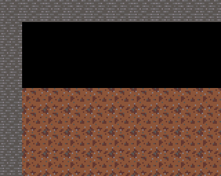
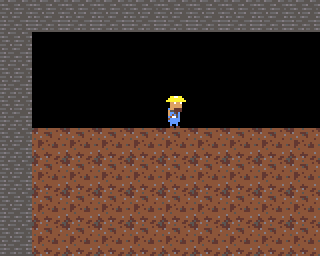
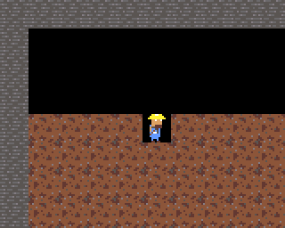
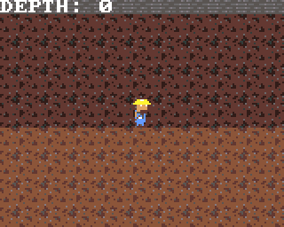

# Making a Game: *Deeper*

*Build a complete side-view mining game for EMU16 — from an empty screen to a torch-lit, ore-hunting,
save-your-progress little world. No prior EMU16 experience needed; each chapter ends with something you
can run.*

> 🎞️ *A GIF of the finished game goes here once it's built.*

## What you'll build

A digger who walks, jumps, and tunnels through a destructible mine, with a follow-camera descent into
torch-lit darkness, ore to collect, a surface shop, hazards, sound, and saved progress. We add one
system at a time — you always have a working game.

## How to read this

Every chapter ends with a **▶ Run it** box: a command and exactly what you should see. Code is shown as
**additions** to the file you're building. If something breaks, each checkpoint links to its **complete
source** under [`examples/tutorial/`](../examples/tutorial) — diff your file against it to spot what's
missing.

You'll want the repo built (`pc_emu` for quick checks, or the browser sim / hardware to actually play).
Compile a chapter with `python main.py <your-file>.txt --save-rom deeper`.

## Contents

1. [A world on screen](#chapter-1--a-world-on-screen) ✅
2. [The digger appears](#chapter-2--the-digger-appears) ✅
3. [Gravity, walk & jump](#chapter-3--gravity-walk--jump) ✅
4. [Dig!](#chapter-4--dig) ✅
5. [Down the mine](#chapter-5--down-the-mine) ✅
6. The surface & the descent *(next)*
7. Torchlight
8. Ore & the shop
9. Hazards & health
10. Sound & feel
11. Save your mine
12. Make it your own

---

## Chapter 1 — A world on screen

Before anything digs, there has to be something to dig *through*. In this chapter we put a mine on the
screen: a wall of dirt, a stone border, and a little pocket of open air at the top.

The key idea — the one everything else in this game leans on — is that **the world is just a grid of
bytes**. One byte per 16×16 tile, and that byte is the tile's *pattern slot* (which art to draw). Later
that exact same grid becomes the collision map and the thing you dig into. One array, many readers.

### 1.1 The skeleton and the frame loop

Start a file (call it `deeper.txt`). Pull in the libraries we need, the generated asset ids (the next
step explains those), and set up the shape every EMU16 game has — a loop that builds a frame and
presents it:

```c
include "../../lib/io.lib";      // input (used from Chapter 3)
include "../../lib/ppu.lib";     // the PPU command builder + the frame shape
include "../../lib/scene.lib";   // scene_stream: draw the visible window of the world
include "deeper_assets.gen.txt"; // PAL_MASTER / ANIM_*_ID -- generated by image_import (next step)
{
    int main() {
        while (true) {
            cmd_reset();            // start a fresh frame's command list
            ppu_backdrop(0x0000);   // clear to black
            // ... build the frame here ...
            ppu_present();          // hand the frame to the PPU: compose, display, pace
        }
        return 0;
    }
}
```

The CPU never draws pixels itself. Each frame it *builds a little command list* (`cmd_reset` …
`ppu_present`) and the PPU composites tiles and sprites from it. That's the whole rhythm of the game.

### 1.2 Draw the art, import it with the tools

A tile — and later a sprite — is a 16×16 image of palette indices. You *could* type those bytes by
hand, but EMU16 has a real asset pipeline: draw in **LibreSprite**, import with `image_import.py`, pack
into a `.pak` the game loads. We use it from the start.

Draw your **dirt** and **stone** tiles (16×16 each) in LibreSprite over a shared palette, and export each
as an indexed PNG + its JSON, plus the palette as a `.gpl`. (The finished art for *Deeper* is in
[`assets/sprites/tutorial/`](../assets/sprites/tutorial) — the two tiles and the miner sheets — all
sharing `assets/sprites/master.gpl`.) List them for the importer in a small `tutorial.list`:

```
master  ../master.gpl  -           -
dirt    dirt.png       dirt.json    10
stone   stone.png      stone.json   10
# (the miner sheets join this list in Chapter 2)
```

Then build the pak — two commands:

```
python tools/image_import.py assets/sprites/tutorial/tutorial.list build/tutorial_assets
python tools/pack_assets.py  build/tutorial_assets/assets.manifest  build/roms/deeper
```

`image_import` writes **`deeper_assets.gen.txt`** — the `const` ids your game includes (`PAL_MASTER`,
`ANIM_DIRT_ID`, `ANIM_STONE_ID`, …) — plus one `.bin` per asset; `pack_assets` bundles those into
**`build/roms/deeper.pak`**. Copy `deeper_assets.gen.txt` next to your `deeper.txt` so the `include`
above finds it.

> **The AIR tile is free.** Pattern slot 0 is never written, so it stays all-zero = palette index 0 =
> black. That blank slot is our **AIR** tile — empty space needs no art. (In a *sprite*, index 0 is
> transparent — same byte, and it's what gives the miner a shape instead of a square.)

### 1.3 The world grid (and a look ahead)

Here's the star of the show — the byte grid, plus the property table it will pair with later:

```c
    const MAP_W = 24;  const MAP_H = 40;                 // 24 wide, 40 deep
    const T_AIR = 0;   const T_DIRT = 1;   const T_STONE = 2;

    var byte world[960];                                  // MAP_W * MAP_H, one tile id per cell

    // Read from Chapter 3 on: bit 0 = solid, bit 2 = diggable. Here just so you can see the plan:
    // the SAME id that picks the art also indexes this table to get the tile's behaviour.
    var byte tile_flags[8] = { 0, 5, 1, 0, 0, 0, 0, 0 };  // air=0  dirt=solid+dig  stone=solid
```

We fill the grid in code: a stone border so nothing can escape, dirt inside, and a carved pocket at the
top so there's some open air to see:

```c
    void build_world() {
        var int x; var int y; var int idx;
        y = 0;
        while y < MAP_H {
            x = 0;
            while x < MAP_W {
                idx = y * MAP_W + x;
                if x == 0 { world[idx] = T_STONE; }
                else if x == MAP_W - 1 { world[idx] = T_STONE; }
                else if y == 0 { world[idx] = T_STONE; }
                else if y == MAP_H - 1 { world[idx] = T_STONE; }
                else { world[idx] = T_DIRT; }
                x = x + 1;
            }
            y = y + 1;
        }
        y = 1;
        while y <= 3 { x = 1; while x < MAP_W - 1 { world[y * MAP_W + x] = T_AIR; x = x + 1; } y = y + 1; }
    }
```

### 1.4 Load the art, draw the world

Load the palette and tiles from the pak into PPU memory once, at the top of `main` — `sys_ppu_dma`
copies a pak asset straight into PPU RAM — then call `build_world`:

```c
        sys_ppu_dma(PAL_MASTER, PPU_PAL);                     // the palette
        ppu_upload_font(&font8x8);
        sys_ppu_dma(ANIM_DIRT_ID,  PPU_PAT + T_DIRT * 256);   // dirt art  -> slot 1
        sys_ppu_dma(ANIM_STONE_ID, PPU_PAT + T_STONE * 256);  // stone art -> slot 2

        build_world();
```

Then one line inside the loop turns the grid into pixels:

```c
            scene_stream(&world, MAP_W, MAP_H);   // between ppu_backdrop and ppu_present
```

`scene_stream` reads the world array and pushes the on-screen window of tiles to the PPU, drawing each
cell with the art at its slot. With no camera set yet, it shows the top-left corner.

> **▶ Run it**
> ```
> python main.py deeper.txt --save-rom deeper     # (deeper.pak was built in step 1.2)
> ```
> Run `deeper.rom` with `deeper.pak` beside it, in the browser sim or `pc_emu`. You should see the top
> of the mine: a **stone border**, a **black pocket** of air, and a wall of **textured dirt** below.
>
> 
>
> 📄 Full source: [`examples/tutorial/ch01.txt`](../examples/tutorial/ch01.txt)

That's a world. It doesn't do anything yet — but it's a real, addressable grid, and in the next chapter
we drop a digger onto it.

---

## Chapter 2 — The digger appears

Time to meet our miner. Unlike the world, the player isn't a background tile — it's a **sprite**: a small
image the PPU draws *on top* of the tiles, at any pixel position. His art is already in our pipeline; we
load it and let `anim.lib` cycle the frames. He doesn't move yet — he just stands there.

### 2.1 Add the miner to the pak

The miner sheets are already drawn in [`assets/sprites/tutorial/`](../assets/sprites/tutorial), sharing
the same palette (no new colours to declare — that's the point of one shared `.gpl`). Add them to
`tutorial.list` and rebuild the pak with the two commands from Chapter 1:

```
miner       miner.png           miner.json            5
miner_walk  miner_walking.png   miner_walking.json    5
miner_jump  miner_jumping.png   miner_jumping.json    5
miner_mine  miner_mining.png    miner_mining.json     5
```

Now `deeper_assets.gen.txt` also defines `ANIM_MINER_ID` (idle, 2 frames), `ANIM_MINER_WALK_ID` (3),
`ANIM_MINER_JUMP_ID` (2), and `ANIM_MINER_MINE_ID` (5). We use the idle here; walk/jump/mine come later.

### 2.2 Load the idle clip

A **clip** in `anim.lib` is a run of consecutive pattern slots — one per frame. DMA the miner's 2-frame
idle to slots 8–9, clear of the tile slots (1, 2):

```c
    const PAT_IDLE = 8;                        // the idle clip's first slot
```
```c
        sys_ppu_dma(ANIM_MINER_ID, PPU_PAT + PAT_IDLE * 256);   // 2 frames -> slots 8, 9
```

> **Index 0 is transparent in a sprite** — every `0` in the miner's art lets the background show through,
> which is what gives him a *shape* instead of a square. (Same byte that makes slot 0 our black AIR tile.)

### 2.3 Let anim.lib run it

The player lives in **world pixel** coordinates (not screen — `scene_draw` converts that for us):

```c
    var int player_x = 0;   var int player_y = 0;
```

At boot, after `build_world()`, place him and start the clip:

```c
        player_x = 5 * 16;   player_y = 48;         // stand in the pocket, on top of the dirt
        anim_play(0, PAT_IDLE, 2, clip_period[ANIM_MINER_ID]);   // 2 frames, at the miner's own speed
```

`anim_play(entity, base, count, period)` starts a clip; from there `anim.lib` tracks time itself. Each
frame we ask `anim_pat(0)` which slot to draw *now* — it returns 8 or 9 by elapsed time, so the animation
runs at the same speed no matter the frame rate.

> **The `period` is your LibreSprite frame duration.** `image_import` read the duration you set per frame
> and wrote it into `clip_period[]` (in `deeper_assets.gen.txt`), indexed by asset id. Passing
> `clip_period[ANIM_MINER_ID]` means the speed you drew in LibreSprite is the speed it plays — set it in
> the editor, not in code.

### 2.4 Draw the miner

Sprites go through a tiny cast each frame — clear it, add the player at his world position, draw. Put
these three lines between `scene_stream(...)` and `ppu_present()`:

```c
            scene_clear();                                  // begin this frame's sprite cast
            scene_obj(anim_pat(0), player_x, player_y, 0);  // add the miner (world coords)
            scene_draw();                                   // world -> screen -> OAM
```

`scene_draw` turns his world position into a screen position (via the camera, still parked at the
top-left) and hands it to the PPU as a sprite.

> **▶ Run it**
> ```
> python main.py deeper.txt --save-rom deeper
> ```
> The miner should be standing on the dirt in the pocket, his idle animation cycling as `anim.lib`
> steps through the clip.
>
> 
>
> 📄 Full source: [`examples/tutorial/ch02.txt`](../examples/tutorial/ch02.txt)

He's just standing there — but he's a real sprite at a real world position, animating on his own clock.
In Chapter 3 we give him weight: gravity, walking, and a jump.

---

## Chapter 3 — Gravity, walk & jump

This is the chapter that turns a picture into a game. `lib/platform.lib` gives the miner velocity and
gravity, and slides him along solid tiles — colliding against the **same grid we drew**. A tile is solid
purely because of its `tile_flags` entry, so the world you painted *is* the level geometry. The physics
is all code; the only new art is the walk and jump clips already in your pak.

### 3.1 Hand the world to the physics

`platform.lib` needs three things: the grid, its dimensions, and the flags table. Bind them once, drop
the miner into the pocket, and pin the frame rate (the physics steps per frame, so a steady rate keeps a
steady feel):

```c
        plat_bind(&world, MAP_W, MAP_H, &tile_flags);   // collide against this exact grid
        plat_spawn(5 * 16, 32);                          // drop him into the air pocket
        sys_set_fps(60);
```

This is the payoff of Chapter 1's "one grid, two readers." The renderer reads `world` to draw tiles; the
physics reads the *same* `world` (through `tile_flags`, testing bit 0 for solid) to decide what to stand
on. Dirt and rock are solid, air isn't — and that falls out of the table, not special-case code.

### 3.2 Turn input into one physics step

Each frame, read the d-pad into a direction and a jump, then take one step:

```c
    // (declare `var int ix; var int jmp; var int pattr;` at the top of main)
            ix = 0;
            if button(BTN_LEFT)  { ix = 0 - 1; }
            if button(BTN_RIGHT) { ix = 1; }
            jmp = 0;
            if button_pressed(BTN_A) { jmp = 1; }
            plat_update(ix, jmp);
```

`plat_update(input_x, jump_pressed)` takes `input_x` as −1/0/+1 (walk) and a jump *only on the frame A is
freshly pressed* — that's what `button_pressed` gives you (an edge, not a hold), so tapping jumps once.
For edges to work, call `buttons_update()` once per frame (we put it just before `ppu_present`).

### 3.3 Draw him where the physics put him

Swap Chapter 2's fixed position for the live one, and flip the sprite to face his heading:

```c
            pattr = 0;
            if plat_facing == (0 - 1) { pattr = 1; }        // attr bit 0 = flip horizontally
            scene_obj(anim_pat(0), plat_x, plat_y, pattr);
```

`platform.lib` tracks `plat_x` / `plat_y` (his position) and `plat_facing` (−1 left, +1 right) for you.

### 3.4 Animate his state

The pak has walk and jump sheets too — DMA them to their slots (alongside the idle DMA from Chapter 2):

```c
    const PAT_WALK = 10;   // 3 frames -> slots 10,11,12
    const PAT_JUMP = 13;   // 2 frames -> slots 13,14
```
```c
        sys_ppu_dma(ANIM_MINER_WALK_ID, PPU_PAT + PAT_WALK * 256);
        sys_ppu_dma(ANIM_MINER_JUMP_ID, PPU_PAT + PAT_JUMP * 256);
```

Then each frame, pick the clip that matches his state. `anim_play` only restarts a clip when it
*changes*, so calling it every frame is fine — hold a walk and it keeps its phase:

```c
            if plat_grounded == 0 { anim_play(0, PAT_JUMP, 2, clip_period[ANIM_MINER_JUMP_ID]); }
            else { if ix == 0 { anim_play(0, PAT_IDLE, 2, clip_period[ANIM_MINER_ID]); }
                   else { anim_play(0, PAT_WALK, 3, clip_period[ANIM_MINER_WALK_ID]); } }
```

Airborne → jump clip; on the ground and moving → walk; standing still → idle — each at the frame speed you
set for it in LibreSprite (`clip_period[...]`). This replaces the single boot-time `anim_play` we started
with.

> **▶ Run it**
> ```
> python main.py deeper.txt --save-rom deeper
> ```
> **←/→** to walk, **A** to jump. He falls out of the air, lands on the dirt, and runs along it —
> playing his walk cycle as he moves and his jump pose in the air. The camera doesn't follow yet (that's
> Chapter 5), so stay on-screen for now.
>
> 
>
> 📄 Full source: [`examples/tutorial/ch03.txt`](../examples/tutorial/ch03.txt)

That's a platformer. He can move, but he can't yet do the one thing this game is about — **dig**. That's
next, and it's where the "one grid" idea really pays off.

---

## Chapter 4 — Dig!

Here's the whole reason we built the world as a grid. To dig, we change one byte — `world[idx] = AIR` —
and *two* things happen at once: the tile vanishes from the screen (the renderer reads `world`) and it
stops being solid (the physics reads `world`). No "update the collision map" step, no re-render request.
One write, both payoffs.

### 4.1 Aim at a tile

Each frame, work out which tile the miner points at — the one just past his body in the way he's facing,
or the tile under his feet (**Down**) / above his head (**Up**):

```c
            if button(BTN_DOWN) {
                tx = (plat_x + 8) >> 4;   ty = ((plat_y + 15) >> 4) + 1;   // under the feet
            } else { if button(BTN_UP) {
                tx = (plat_x + 8) >> 4;   ty = ((plat_y + 1) >> 4) - 1;     // above the head
            } else {
                if plat_facing == 1 { tx = (plat_x + 12) >> 4; } else { tx = (plat_x + 3) >> 4; }
                ty = (plat_y + 8) >> 4;                                     // in front, mid-body
            } }
```

Then check it's in bounds and *diggable* — bit 2 of its `tile_flags` (dirt has it, stone doesn't):

```c
            dig_now = 0;
            if tx >= 0 { if tx < MAP_W { if ty >= 0 { if ty < MAP_H {
                t = world[ty * MAP_W + tx];
                if (tile_flags[t] & F_DIG) != 0 { if button(BTN_B) { dig_now = 1; } }
            } } } }
```

### 4.2 Swing, then break

Digging isn't instant — hold **B** and the miner works the tile for `DIG_TIME` frames, then it breaks. A
little state tracks which tile he's on (aim elsewhere and the timer restarts):

```c
    const F_DIG    = 4;    // tile_flags bit 2 = diggable
    const DIG_TIME = 30;   // ~0.5s at 60fps
    var int digging = 0;   var int dig_tx = 0;   var int dig_ty = 0;   var int dig_timer = 0;
```
```c
            if dig_now == 1 {
                if dig_tx != tx { digging = 0; }
                if dig_ty != ty { digging = 0; }
                if digging == 0 { digging = 1; dig_tx = tx; dig_ty = ty; dig_timer = DIG_TIME; }
                dig_timer = dig_timer - 1;
                if dig_timer <= 0 { world[dig_ty * MAP_W + dig_tx] = T_AIR; digging = 0; }
            } else { digging = 0; }
```

That one line — `world[...] = T_AIR` — is the payoff. Next frame the renderer draws air there, and the
physics lets him walk (or fall) into it: dig down and gravity drops him into the shaft; dig sideways and
he steps through.

### 4.3 The swing animation

While digging, play the 5-frame mining clip — it takes priority over walk/idle/jump:

```c
            if digging == 1 { anim_play(0, PAT_MINE, 5, clip_period[ANIM_MINER_MINE_ID]); }
            else { /* the jump / walk / idle logic from Chapter 3 */ }
```

> **▶ Run it**
> ```
> python main.py deeper.txt --save-rom deeper
> ```
> Stand on the dirt and hold **B** — he swings his pick and a tile breaks. **Down + B** mines straight
> down and drops him into the shaft; **Up + B** breaks the block above his head. Stone (the border) won't
> budge — it isn't diggable.
>
> 
>
> 📄 Full source: [`examples/tutorial/ch04.txt`](../examples/tutorial/ch04.txt)

You now have the entire core loop: a digger tunnelling through a destructible world. Everything from here
adds richness — but *this is the game*. Next, we let the camera follow him down into the deep.

---

## Chapter 5 — Down the mine

The mine is meant to be *deep* — far taller than the screen. Two things change: the world becomes a real,
big, hand-designed place (not a `build_world` loop), and the camera **follows** the miner down into it.

### 5.1 Paint the map, import it

Hand-typing a 100×100 grid would be miserable, so we *paint* it. In LibreSprite, make an indexed PNG
where **one pixel = one tile** — here `assets/maps/deeper_map.png`, 100×100: a stone cap, a band of open
**dirt-background** at the top (the surface), then solid dirt below. A legend maps each palette index to a
tile id + its flags:

```
# assets/maps/deeper_legend.txt
flags solid=0 dig=2
0 1 solid dig     # dirt  -> slot 1, solid + diggable
1 2 solid         # stone -> slot 2, solid border
2 3               # dirt background -> slot 3, visible but NOT solid
```

`pixel_map.py` turns the PNG + legend into the same `world[]` and `tile_flags[]` you built by hand before
— now painted:

```
python tools/pixel_map.py assets/maps/deeper_map.png assets/maps/deeper_legend.txt \
    examples/tutorial/deeper_map.gen.txt
```

The new tile, **dirt-background**, is a normal tile with *no* solid flag — you walk and fall through it;
it's just something to look at behind open space. Add its art (`dirt_background.png`) to `tutorial.list`
and rebuild the pak, then include both generated files and drop `build_world`:

```c
include "deeper_assets.gen.txt";     // now also defines ANIM_DIRT_BG_ID
include "deeper_map.gen.txt";        // MAP_W / MAP_H / world[] / tile_flags[]
```
```c
        sys_ppu_dma(ANIM_DIRT_BG_ID, PPU_PAT + T_DIRT_BG * 256);   // T_DIRT_BG = 3
        // no build_world() -- the map arrived already filled
        plat_bind(&world, MAP_W, MAP_H, &tile_flags);
        plat_spawn(12 * 16, 1 * 16);   // in the open surface; gravity drops him onto the dirt
```

### 5.2 Let the camera follow

Until now the camera sat at the top-left. One call per frame makes it track the miner, clamped to the
map's edges:

```c
            scene_follow(plat_x, plat_y, MAP_W, MAP_H);   // just before cmd_reset()
```

`scene_stream` already draws whatever window the camera points at, so that's all it takes — dig down and
the world scrolls to keep him in view.

### 5.3 Digging reveals the wall

One tweak to Chapter 4's dig: instead of turning a broken tile into black `AIR`, turn it into
**dirt-background**:

```c
                if dig_timer <= 0 { world[dig_ty * MAP_W + dig_tx] = T_DIRT_BG; digging = 0; }
```

It's still non-solid (he walks and falls through it), but now his tunnels read as carved dirt instead of
holes into nothing.

### 5.4 Show the depth

A little text over everything, telling him how far down he's dug:

```c
            depth = ((plat_y + 15) >> 4) - SURFACE_ROW;   // feet row minus the surface (row 5)
            if depth < 0 { depth = 0; }
            tile_text(0, 0, &s_depth, C_WHITE);           // the "DEPTH:" label
            tile_number(7, 0, depth, C_WHITE);
```

The text plane draws on top of the tiles and sprites, so a HUD costs just a couple of calls.

> **▶ Run it**
> ```
> python main.py deeper.txt --save-rom deeper
> ```
> Mine straight down with **Down + B**. The camera follows you into the dark, the shaft behind you shows
> dirt-background, and **DEPTH** climbs.
>
> 
>
> 📄 Full source: [`examples/tutorial/ch05.txt`](../examples/tutorial/ch05.txt)

The spine is complete — a digger tunnelling a real, deep, authored mine, camera and all. From here we
make it a *game*: a surface to return to, torchlight, ore, danger, sound, and saved progress.
